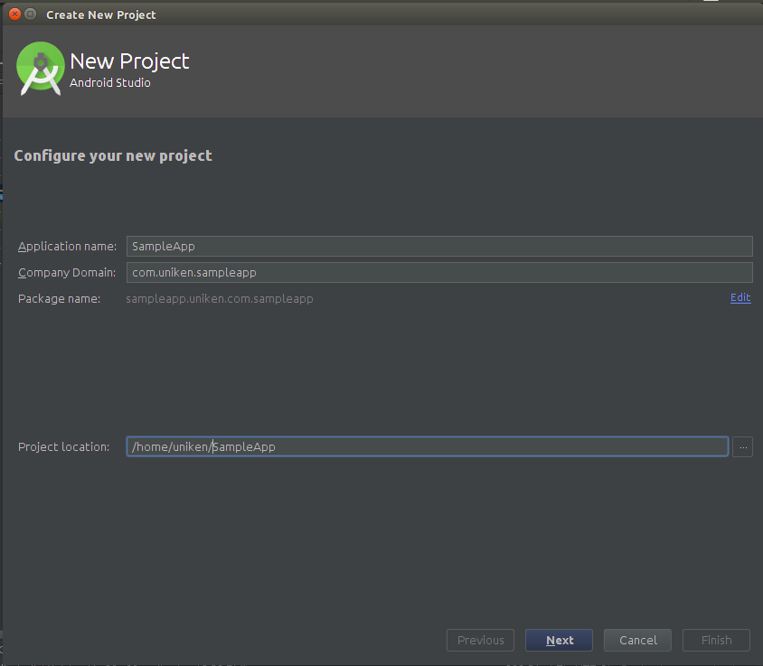
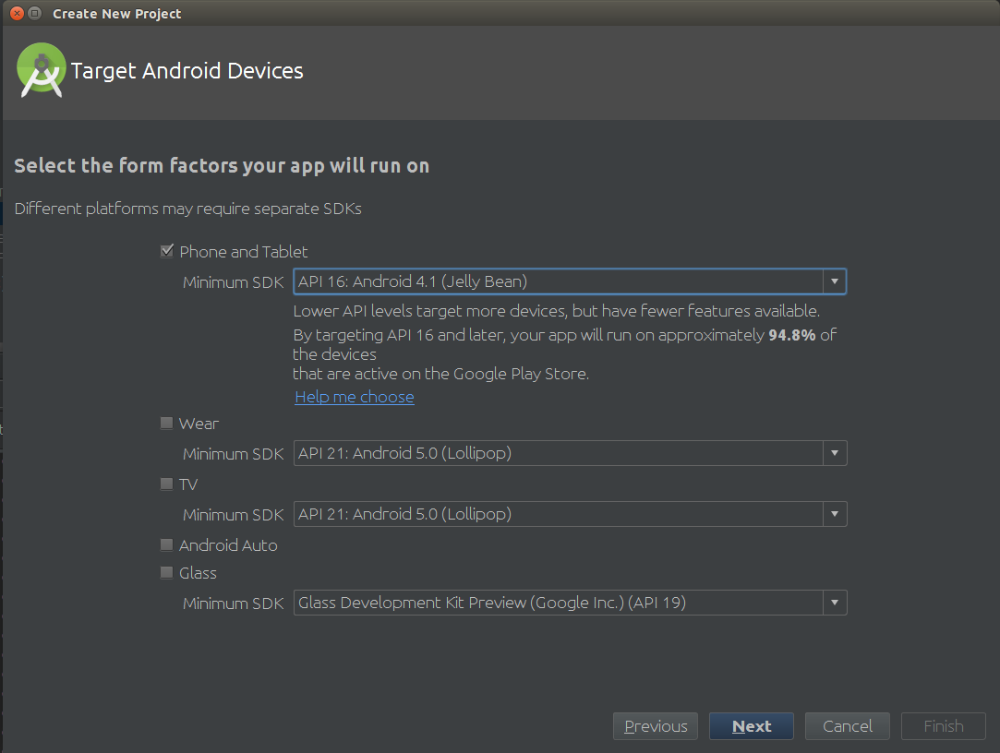
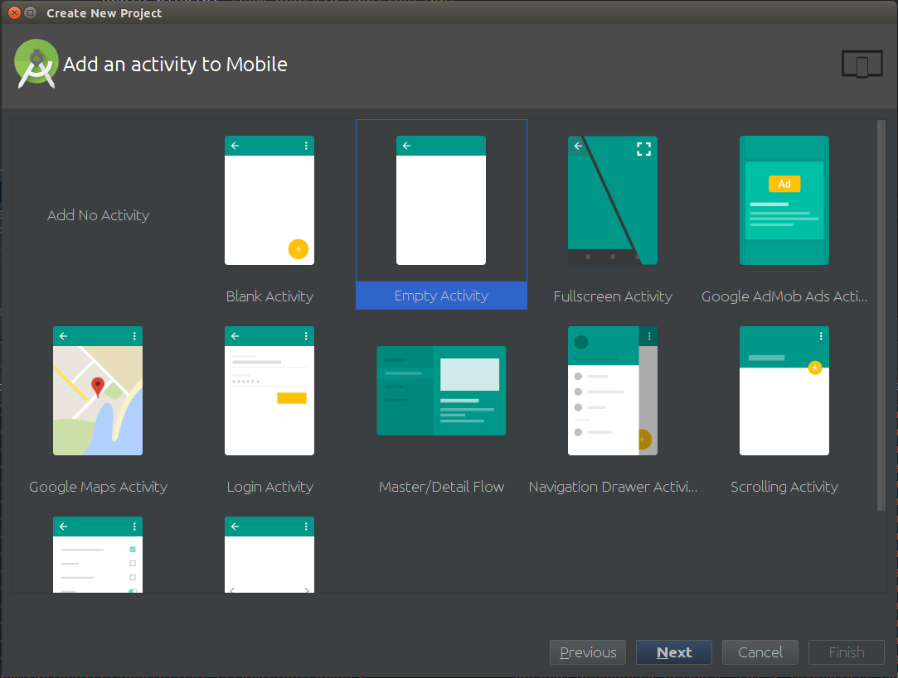
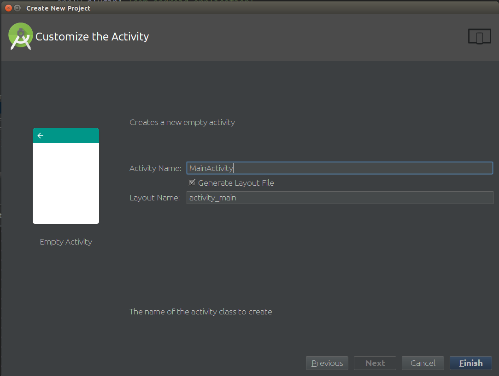
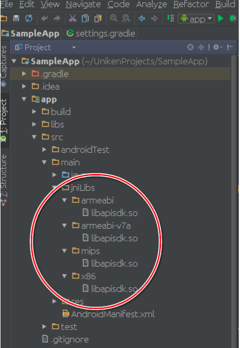
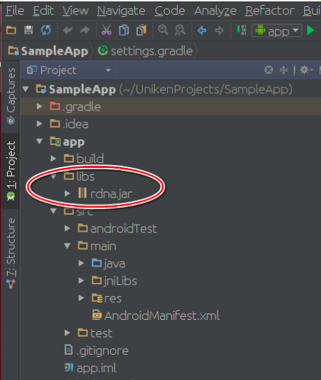

**REL-ID API-SDK for Android**

**Get Started**
---------------

REL-ID is a digital trust platform that connects things, securely. It creates a closed, private, massively scalable, networked application ecosystem to protect enterprise applications and data from unauthorized and fraudulent access and tampering.

The REL-ID API-SDK provides the following features that enable applications to leapfrog ahead in terms of securing themselves - mutual identity and authentication, device fingerprinting and binding, privacy of data, and the digital network adapter (aka DNA).

This guide shows you how to create a new Android project, include the REL-ID API-SDK and how to call it’s APIs .

Once you’ve installed the SDK, read on for the detailed API reference!

**Prerequisites**
-----------------

-   Running Android Studio 1.0 or higher

-   Developing for Android level 16 or higher

In order to complete the Get Started guide, you need to have Android Studio installed on your development machine. If you don't already have it, see the [Android Studio site](https://developer.android.com/sdk/index.html#top) for instructions on how to download everything you need to get up and running.

#### 

#### 

#### **Create a new project**

In this step, you create a brand new project in Android Studio to use for our example. If you don't already have Studio running, go ahead and open it now.

#### **Start the new project wizard**

If you see the above welcome screen, select **New Project**. Otherwise, select **File &gt; New Project** from the menu. This brings up the new project wizard:

#### 

#### **Name your project**

Enter "SampleApp" as the app name, and whatever company domain you use for your apps. Android Studio automatically determines a good project location, but feel free to change it if you'd like.

#### 

#### 

#### **Set the required SDK version**

On the next screen, select **Phone and Tablet** for the form factor and a minimum platform SDK version of 16. That's the minimum version supported by the REL-ID API-SDK.

#### 

#### 

#### 

#### **Add your main activity**

We're keeping it simple for this example, so on this screen select **Empty Activity**.

#### 

#### 

#### 

#### **Name your activity**

On this screen you have the option of choosing names for the app's activity and its related resources. Use the default names for this example, and just click the **Finish** button.

**Compile your new project**

After clicking **Finish**, you have a working project with a single activity. Try compiling and running it (select **Run 'app'** from the **Run** menu). You should see a "Hello world!" message on an otherwise empty gray screen. Don't worry, you'll add some more content in the next steps.

**Adding the SDK to your Android project**

### **Manually, using the SDK download**

If you don't already have the REL-ID API-SDK, grab and unzip it.

**Adding .so Library in Android Studio**

1.  Create Folder "jniLibs" inside "src/main/"

2.  Put all your .so libraries inside "src/main/jniLibs" folder

3.  Folder structure looks like

**Adding .jar file in Android Studio**

1.  Create Folder "libs" inside "app/"

2.  Folder structure looks like

#### 

#### 

#### 

#### **Rebuild your project**

Rebuild and run your project. You'll still see a white screen because you did nothing in your app you just integrated REL-ID API-SDK.

**Sample code highlights**

**Initialize Routine**

This is the first routine that must be made to bootstrap the REL-ID API runtime up. The arguments to this routine are described in the below table. This routine starts up the API runtime (including a DNA instance), and in the process registers the API-client supplied callback routines with the API runtime context. This is a non-blocking routine, and when it returns, it will have initiated the process of creation of a REL-ID session in PRIMARY state - the progress of this operation is notified to the API-client application via the StatusUpdate callback routine supplied by it.

A reference to the context of the newly created API runtime is returned to the API-client. Please check the code snippet below to see how to call REL-ID API-SDK’s static Initialize() method and implement its required callback methods, like (onInitializeCompleted).

**Package** sampleapp.uniken.com.sampleapp;

**import** android.content.pm.PackageInfo;

**import** android.content.pm.PackageManager;

**import** android.os.Bundle;

**import** android.support.v7.app.AppCompatActivity;

**import** android.util.Log;

**import** com.uniken.rdna.RDNA;

**public class** MainActivity **extends** AppCompatActivity {

**final** String **TAG** = **"MainActivity"**;

**public final** String **agentInfo** = **"test Agent Info"**;

**public final** String **cypherSalt** = **"salt"**;

**public final** String **cypherSpec** = **"AES/128/CBC/PKCS7Padding:SHA-1"**;

**public final** String **host** = **"10.0.9.36"**;

**public final int port** = 483;

**private** RDNA.RDNACallbacks **callbacks**;

@Override

**protected void** onCreate(Bundle savedInstanceState) {

**super**.onCreate(savedInstanceState);

setContentView(R.layout.activity\_main);

**callbacks** = **new** RDNA.RDNACallbacks() {

@Override

**public int** onInitializeCompleted(RDNA.RDNAStatusInit status) {

**if** (status.**errCode** == 0)

Log.*e*(**TAG**, **"Initialize Completed Successfully"**);

**else**

Log.*e*(**TAG**, **"Initialize Failed"**);

**return** 0;

}

@Override

**public** Object getDeviceContext() {

**return** getApplicationContext();

}

@Override

**public** String getApplicationFingerprint() {

**return "avsguysdvnh23r76wejfhgqwvshnc7e3tru4251"**;

}

@Override

**public int** onTerminate(RDNA.RDNAStatusTerminate status) {

**if** (status.**errCode** == 0)

Log.*e*(**TAG**, **"Termination Completed Successfully"**);

**else**

Log.*e*(**TAG**, **"Termination Failed"**);

**return** 0;

}

@Override

**public int** onPauseRuntime(**final** RDNA.RDNAStatusPause status) {

**if** (status.**errCode** == 0)

Log.*e*(**TAG**, **"PauseRuntime Completed Successfully"**);

**else**

Log.*e*(**TAG**, **"PauseRuntime Failed"**);

**return** 0;

}

@Override

**public int** onResumeRuntime(**final** RDNA.RDNAStatusResume status) {

**if** (status.**errCode** == 0)

Log.*e*(**TAG**, **"ResumeRuntime Completed Successfully"**);

**else**

Log.*e*(**TAG**, **"ResumeRuntime Failed"**);

**return** 0;

}

@Override

**public int** onConfigRecieved(RDNA.RDNAStatusGetConfig rdnaStatusGetConfig) {

**if** (rdnaStatusGetConfig.**errCode** == 0)

Log.*e*(**TAG**, **"Config Received Successfully"**);

**else**

Log.*e*(**TAG**, **"Unable to get config"**);

**return** 0;

}

@Override

**public int** onChallengeReceived(RDNA.RDNAStatusCheckChallenge rdnaStatusCheckChallenge) {

**if** (rdnaStatusCheckChallenge.**errCode** == 0)

Log.*e*(**TAG**, **"Challenge Recieved Successfully"**);

**else**

Log.*e*(**TAG**, **"Unable to get Challenge"**);

**return** 0;

}

@Override

**public int** onLogOff(RDNA.RDNAStatusLogOff rdnaStatusLogOff) {

**if** (rdnaStatusLogOff.**errCode** == 0)

Log.*e*(**TAG**, **"LogOff Successfully"**);

**else**

Log.*e*(**TAG**, **"LogOff Failed"**);

**return** 0;

}

@Override

**public** RDNA.RDNAIWACreds getCredentials(String domainUrl) {

**return new** RDNA.RDNAIWACreds(**"demoUser"**, **"demoPassword"**, RDNA.RDNAIWAAuthStatus.***AUTH\_SUCCESS***);

}

@Override

**public** String getApplicationName() {

**return** getApplicationContext().getString(R.string.app\_name);

}

@Override

**public** String getApplicationVersion() {

String version = **null**;

**try** {

PackageInfo pInfo;

pInfo = getApplicationContext().getPackageManager().getPackageInfo(getApplicationContext().getPackageName(), 0);

version = String.*valueOf*(pInfo.**versionName**);

} **catch** (PackageManager.NameNotFoundException e) {

e.printStackTrace();

}

**return** version;

}

};

RDNA.RDNAStatus&lt;RDNA&gt; rdnaStatus = RDNA.*Initialize*(**agentInfo**, **callbacks**, **host**, **port**, **cypherSpec**, **cypherSalt**, **null**, getApplicationContext());

**if** (rdnaStatus.**errorCode** == 0)

Log.*e*(**TAG**, **"Initialize Call Successful"**);

**else**

Log.*e*(**TAG**, **"Initialize Call Failed"**);

}

}

**API methods and their description**
-------------------------------------

**Initialize method**

API-client should call initialize function which initializes and returns an instance of RDNA context.

Most importantly, this is the phase when the API runtime establishes an agent-authenticated session with the REL-ID platform backend and bootstraps the DNA for subsequent connectivity with both REL-ID platform services as well as the configured backend enterprise services

The following information is supplied by the API-client application to the initialization routine:

1.  Agent information (available as a base64-encoded blob, upon provisioning a new agent REL-ID on a commercially licensed REL-ID Gateway Manager)

2.  Callback methods that the API runtime will use to communicate with the API-client application (status/error notifications, device context/fingerprint retrieval)

3.  Network coordinates of the REL-ID Authentication Gateway (hostname/IP address and port number)

4.  Privacy (encryption) specifications for the Data Privacy APIs - includes cipher specs and salt to use

5.  Opaque reference to the API-client application context (never interpreted/modified by the API runtime, placeholder for application)

6.  If applicable, proxy information for connecting through to the REL-ID Auth Gateway

-   *static RDNAStatus&lt;RDNA&gt; Initialize(String agentInfo, RDNACallbacks callbacks,*

*String authGatewayHNIP, int authGatewayPORT,*

*String cipherSpecs, String cipherSalt,*

*RDNAProxySettings proxySettings, Object appCtx);*

**Description**

-   This method initializes the sdk by connecting out to given REL-ID server coordinate and creates REL-ID session.

**Parameters**

*agentInfo*

-   Software identity information for the API-runtime to authenticate and establish primary session connectivity with the REL-ID platform backend.

*callbacks*

-   callback object

*authGatewayHNIP*

-   Hostname/IP of the gateway server

*authGatewayPORT*

-   Port of the gateway server

*cipherSpec*

-   Cipher mode to be used

*cipherSalt*

-   Cipher salt

*proxySettings(optional)*

-   Parent proxy settings of the application

*appCtx*

-   Application context

**Returns**

-   Returns object of RDNA.RDNAStatus which contain RDNA object and error code.

**PauseRuntime method**

Routine that terminates the API runtime, saves a private copy of the relevant data structures, and returns an encoded dump of the saved information as a null-terminated string.

When an API-client application is asked to pause itself, it anyway saves its runtime state in a bundle of some kind and persists it (either using OS services, or separately where it knows to look when the application is resumed)

At this point, the API-client application must also invoke the PauseRuntime routine and save the returned string as well.

-   *RDNAStatus&lt;byte\[\]&gt; pauseRuntime();*

**Description**

-   pauseRuntime: method signals the RDNA to pause its execution and save its state and return it to caller.

**Returns**

-   Returns object of RDNA.RDNAStatus which contain byte\[\] and error code.

**ResumeRuntime method**

Routine that accepts a previously saved private copy of the API runtime, and restores the API runtime back to the saved state while validating some of the saved state (like session information - validity/life, other information).

When an API-client application is asked to resume itself, it anyway restores its own runtime status from a previously persisted information bundle of some kind.

Before it does that, it should first restore the previously persisted private copy of the API runtime state (from a previously executed PauseRuntime) and invoke the ResumeRuntime routine passing this state information in to it.

-   *static RDNAStatus&lt;RDNA&gt; resumeRuntime(byte\[\] pauseState,*

*RDNACallbacks callbacks, RDNAProxySettings proxySettings, Object appCtx);*

**Description**

-   This method is used to signal the DNA thread to resume execution.

**Parameters **

*pauseState*

-   byte\[\] return from pauseRuntime method.

*callbacks*

-   callback object

*proxySettings* (optional)

-   Parent proxy settings of the application

*appCtx*

-   Application context

**Returns**

-   Returns object of RDNA.RDNAStatus which contains RDNA object and error code.

**Terminate method**

The terminate API routine should be called during application shutdown in order to cleanly terminate the API runtime.

- *int terminate();*

**Description**

-   This method terminates the RDNA context.

**Returns**

-   Appropriate error code of the error that occurred or success.

**GetServiceByServiceName Method**

Retrieve the Service class object by looking up the unique logical name of the backend service (as configured in the REL-ID Gateway Manager) or returns error if there is no such service exists.

-   *RDNAStatus&lt;RDNAService&gt; getServiceByServiceName(String serviceName);*

**Description **

-   This method is used to get the details of the tunnelling service w.r.t. its name.

**Parameters**

*serviceName*

-   Name of the service.

**Returns**

-   Returns object of RDNA.RDNAStatus which contains RDNAService object and error code.

**GetServiceByTargetCoordinate Method**

Retrieve one or more Service class object(s) by looking up the target (masked) coordinate, corresponding to the backend enterprise service. More than one services could be returned, depending on the access configuration for the context.

-   *RDNAStatus&lt;RDNAService\[\]&gt; getServiceByTargetCoordinate(*

*String targetHNIP, int targetPORT);*

**Description**

-   This method is used to get the details of the tunnelling service/services w.r.t. its destination co-ordinates.

**Parameters**

*targetHNIP*

-   Destination host-name/IP of the service

*targetPORT*

-   Destination port of the service.

**Returns**

-   Returns object of RDNA.RDNAStatus which contains list of RDNAService in result field and appropriate error code.

**GetAllServices Method**

Return's list of all the services configured.

-   *RDNAStatus&lt;RDNAService\[\]&gt; getAllServices();*

**Description**

-   This method is used to get the details of all the services that are running.

**Returns**

-   Returns object of RDNA.RDNAStatus which contains list of RDNAService in result field and appropriate error code.

**ServiceAccessStart Method**

Access to the service (i.e. the corresponding backend enterprise service) via the access port for the Service is started.

In case of TYPE\_PROXY port, the proxy facade of the DNA in the API-runtime listening on that port will start *tunneling* requests/data to the corresponding backend service.

In case of TYPE\_PORTF port, the corresponding forwarded TCP port is started in the DNA in the API-runtime, and made ready to accept connections from which data will be transparently forwarded to the corresponding backend service.

-   *int serviceAccessStart(RDNAService service)*

**Description**

-   This method is called to start a particular tunnelling service.

**Parameters**

*service*

-   Object containing the service details. Name is mandatory and the only parameter to uniquely identify the service.

**Returns**

-   Appropriate error code of the error that occurred or success.

**ServiceAccessStop Method**

Access to the service (i.e. the corresponding backend enterprise service) via the access port for the Service is stopped

In case of TYPE\_PROXY port, the proxy facade of the DNA in the API-runtime listening on that port will stop *tunneling* requests/data to the corresponding backend service and it will revert with an appropriate HTTP Proxy error code for further access to this service

In case of TYPE\_PORTF port, the corresponding forwarded TCP port is shut down and closed in the DNA in the API-runtime, and connections to that port will no longer be accepted.

-   *int serviceAccessStop(RDNAService service);*

**Description**

-   This method is called to stop a particular tunnelling service.

**Parameters**

*service*

-   Object containing the service details. Name is mandatory and the only parameter to uniquely identify the service.

**Returns**

-   Appropriate error code of the error that occurred or success.

**ServiceAccessStartAll Method**

This method is used to start all the services that are configured on the connecting server.

-   *int serviceAccessStartAll();*

**Description**

-   Starts all the non-running tunnelling services

**Returns**

-   Appropriate error code of error that occurred or success.

**ServiceAccessStopAll Method**

This method is used to stop all the services that are configured on the connecting server.

-   *int serviceAccessStopAll();*

**Description**

-   Stops all the running tunnelling services

**Returns**

-   Appropriate error code of error that occurred or success.

**GetDefaultCipherSpec Method**

Get the default cipher spec used in the RDNA context

-   *RDNAStatus&lt;String&gt; getDefaultCipherSpec();*

**Description**

-   This method is used to get the default cipher spec

**Returns**

-   Returns RDNAStatus object which contains cipher specification in result and appropriate error code.

**GetDefaultCipherSalt Method**

Get the default cipher salt used in the RDNA context

-   *RDNAStatus&lt;byte\[\]&gt; getDefaultCipherSalt();*

**Description**

-   This method is used to get the default cipher salt

**Returns**

-   Returns RDNAStatus object which contains cipher salt specification in result and appropriate error code.

**EncryptDataPacket Method**

Raw plaintext (unencrypted) data is supplied as a buffer of bytes.

This data is encrypted using keys as per specified privacy scope, and returned to calling API-client application.

-   *RDNAStatus&lt;byte\[\]&gt; encryptDataPacket(*

*RDNAPrivacyScope privacyScope,*

*String cipherSpec, byte\[\] cipherSalt,*

*byte\[\] plainText);*

**Description**

-   This method used to encrypt the data packet.

**Parameters**

*privacyScope*

-   Privacy scope of the stream.

*cipherSpec*

-   Cipher to be used.

*cipherSalt*

-   Cipher salt.

*plainText*

-   Input the plain string data packet.

**Returns**

-   Returns RDNAStatus object which contains cipher text data packet in result and appropriate error code.

**DecryptDataPacket Method**

Encrypted data is supplied as a buffer of bytes.

This data is decrypted using keys as per specified privacy scope, and returned to calling API-client application.

-   *RDNAStatus&lt;byte\[\]&gt; decryptDataPacket(*

*RDNAPrivacyScope privacyScope,*

*String cipherSpec, byte\[\] cipherSalt,*

*byte\[\] cipherText);*

**Description**

-   This method decrypts the data packet provided and returns the plain text if successful else the appropriate error code.

**Parameters**

*privacyScope*

-   Privacy scope of the stream.

*cipherSpec*

-   Cipher to be used.

*cipherSalt*

-   Cipher salt.

*cipherText*

-   Input encrypted data packet.

**Returns**

-   Returns RDNAStatus object which contains plain text data packet in result and appropriate error code.

**EncryptHttpRequest Method**

HTTP request in plaintext (unencrypted) form is supplied as a buffer of bytes.

This request is encrypted using keys as per specified privacy scope, encoded appropriately, wrapped around in an HTTP request envelope and returned back to calling API-client application as another HTTP request.

-   *RDNAStatus&lt;String&gt; encryptHttpRequest(*

*RDNAPrivacyScope privacyScope,*

*String cipherSpec, byte\[\] cipherSalt,*

*String request);*

**Description**

-   This method encrypts the original HTTP request and encapsulates it into a dummy httprequest with same destination as the original request.

**Parameters**

*privacyScope*

-   Privacy scope of the stream.

*cipherSpec*

-   Cipher to be used.

*cipherSalt*

-   Cipher salt.

*request*

-   Input plain text string containing the http request.

**Returns**

-   Returns RDNAStatus object with formatted cipher text request in result and appropriate error code.

**DecryptHttpResponse Method**

HTTP response in encrypted form is supplied as a buffer of bytes.

This response is parsed, the embedded encrypted HTTP response is decoded, decrypted using keys as per specified scope, and returned back to calling API-client application as the original plaintext HTTP response.

-   *RDNAStatus&lt;String&gt; decryptHttpResponse(*

*RDNAPrivacyScope privacyScope,*

*String cipherSpec, byte\[\] cipherSalt,*

*String transformedResponse);*

**Description**

-   This method decrypts the HTTP response and returns back the plain string original http response string.

**Parameters**

*privacyScope*

-   Privacy scope of the stream.

*cipherSpec*

-   Cipher to be used.

*cipherSalt*

-   Cipher salt.

*transformedResponse*

-   Input encrypted HTTP response string.

**Returns**

-   Returns RDNAStatus object with decrypted http response in result and appropriate error code.

**GetSdkVersion Method**

Get the API-SDK version number used by the REL-ID API-SDK.

-   *static String getSDKVersion()*

**Description**

-   This method is used to get the current SDK version used by the client.

**Returns**

-   returns the current SDK version used by the REL-ID API-SDK version in string format.

**GetErrorInfo Method**

Get the error information corresponding to an integer error code returned by any API. It returns back RDNAErrorID which gives brief information of the error occurred.

-   *static RDNAErrorID getErrorInfo(int errorCode);*

**Description**

-   This method is called to get enum value from error code.

**Returns**

-   appropriate enum.

**GetSessionID Method**

Get the session ID of the current initialized REL-ID session. Depending on the current state of the API-Runtime, the retrieved session ID will be either of the current application (PRIMARY) REL-ID session or of the current user (SECONDARY) REL-ID session.

-   *RDNAStatus&lt;String&gt; getSessionID();*

**Description**

-   This method returns the session ID of the current initialized REL-ID session.

**Returns**

-   Returns RDNAStatus object with Session ID string in result and appropriate error code.

**GetAgentID Method**

using which the REL-ID session is initialized GetDeviceID Get the device ID of the current device using which the REL-ID session is initialized

*- RDNAStatus&lt;String&gt; getAgentID();*

**Description**

-   This method returns the Agent ID using which the REL-ID session is initialized.

**Returns**

-   Returns RDNAStatus object with Device ID string in result and appropriate error code.

**CheckChallenge Method**

This routine submits one or more challenges like (secret questions and answer, verification keys and access codes, passwords, responses to challenges etc) with the REL-ID backend, to authenticate the end-user. This can be used to - \* To check the user status - whether this user requires authentication on this device, what authentication to perform for this user, whether the user is blocked (on this device and/or app, or otherwise). \* To check the username and password. \* To check the additional authentication credentials such as secret answer, captcha, etc

The result is one of the following - \* FAILURE, &lt;reason&gt; \* CHALLENGE, &lt;challenge&gt; \* SUCCESS, &lt;eurelid&gt;

The result is informed to API-client via status update (core) / event notification (wrapper) callback routines.

Multiple successful invocations of this routine may be needed before receiving a SUCCESS, &lt;eurelid&gt; result from this routine, with the same challenge (retries) and/or different challenges (additional authentication).

-   *int checkChallenges(RDNAChallenge\[\] challenges,String userID);*

**Description**

-   This method is used to send the response of challenges to server for authentication

**Parameters**

*userID*

-   Unique user id.

*challenges*

-   Challenges with response set to it.

**Returns**

-   Appropriate error code of error that occurred or success.

**UpdateChallenge Method**

The purpose of this routine is to update one or more credentials of the end-user. This routine can only be invoked if AuthenticateUser routine has been successfully completed. Pretty much all the relevant credentials of the end-user - secret question(s) and answer(s), one-time-use access code generation seeds, primary password(s), device binding to user-app etc - may be updated using this routine. The result is informed to API-client via status update (core) / event notification (wrapper) callback routines.

-   *int updateChallenges(RDNAChallenge\[\] challenges,String userID);*

**Description**

-   This method is used to update the challenges.

**Parameters**

*challenges*

-   List of challenges to update

*userID*

-   Unique user id.

**Returns**

-   Appropriate error code of error that occurred or success.

**GetConfig Method**

The purpose of this routine is to get the configuration (if any) needed for API-Client from the REL-ID backend server so that the behavior of the API-Client can be made configurable in some use cases. For example - password policy to be validated when password is set/changed, customization settings, other application/user level settings, etc. The result is informed to API-client via status update (core) / event notification (wrapper) callback routines.

-   *int getConfig(String userID);*

**Description**

-   This method can be used for any state primary or secondary of the RDNA context, and this is used to get the configuration setting from the server.

**Parameters**

*userID*

-   Unique user id.

**Returns**

-   Appropriate error code of error that occurred or success.

**ResetChallenge** **Method**

The purpose of this method is reset the authentication flow. If any error occurs in between when user is trying to authenticate itself with the server, reset challenge needs to be called to get to know to the server that the user is re-starting the authentication flow.

-   *int resetChallenge();*

**Description**

-   This method is used to reset the challenge

**Returns**

-   Appropriate error code of error that occurred or success.

**GetAllChallenges Method**

The purpose of this method is to get all the authentication challenges for updating purpose.

-   int getAllChallenges(String userID);

**Description **

-   This method is used to get all challenges

**Parameters**

*userID*

-   UserID for needs to be provided for which user challenges need to be fetched.

**Returns**

-   Appropriate error code of error that occurred or success.

**LogOff Method**

The purpose of this method is to log off user session and switch back to application session.

-   *int logOff(String userID);*

**Description**

-   This method is used to log off the user session.

**Parameters**

*userID*

-   Unique user id.

**Returns**

-   Appropriate error code of error that occurred or success.

**ForgotPassword Method**

The purpose of this method is to inform server that user has forgotten the authentication credentials to get login and access to the services. Upon calling this API, server throws additional authentication challenges that are required.

-   *int forgotPassword(String userID);*

**Description**

-   This method is responsible to handle use case when client is unable to reach for correct password.

**Parameters**

*userID*

-   Unique user id.

**Returns**

-   Appropriate error code of error that occurred or success.

**SetDNSServers Method**

This method is used to set or add multiple DNS servers, for resolving IP address to domain names.

-   *int setDnsServer(String\[\] dnsServer);*

**Description**

-   This method is used to set the DNS servers manually.

**Parameters**

*dnsServer*

-   This parameter is the array of the DNS server objects, which needs to be set as DNS servers.

**Returns**

-   Appropriate error code of error that occurred or success.

**Callback routines (types, structures, interfaces)**

This structure is supplied to the Initialize routine containing API-client application callback routines. These callback routines are invoked by the API runtime at different points in its execution - for updating status, for requesting the API-client application to supply information etc.

| Callback Routine          | Basic/Advanced | Description                                                                                                                                                                                                                                                                            |
|---------------------------|----------------|----------------------------------------------------------------------------------------------------------------------------------------------------------------------------------------------------------------------------------------------------------------------------------------|
| onInitializeCompleted     | Basic API      | Invoked by the API runtime in order to update the API-client application of the progress of a previously invoked API routine, or state changes and exceptions encountered in general during the course of its execution.                                                               
                                                                                                                                                                                                                                                                                                                                      
                                              *- int onInitializeCompleted(RDNAStatusInit status);*                                                                                                                                                                                                                                   
                                                                                                                                                                                                                                                                                                                                      
                                              **Description**                                                                                                                                                                                                                                                                         
                                                                                                                                                                                                                                                                                                                                      
                                              -   This is a asynchronous callback method that needs to be implemented by the end consumer, to get the initialization details after having invoked initialize to start API runtime.                                                                                                    
                                                                                                                                                                                                                                                                                                                                      
                                              **Parameters**                                                                                                                                                                                                                                                                          
                                                                                                                                                                                                                                                                                                                                      
                                              *status*                                                                                                                                                                                                                                                                                
                                                                                                                                                                                                                                                                                                                                      
                                              -   This parameter contains the RDNAStatusInit class object.                                                                                                                                                                                                                            
                                                                                                                                                                                                                                                                                                                                      
                                              **Returns**                                                                                                                                                                                                                                                                             
                                                                                                                                                                                                                                                                                                                                      
                                              -   appropriate error code or success.                                                                                                                                                                                                                                                  |
| getApplicationFingerprint | Basic API      | Invoked by the API runtime during initialization (session creation) in order to retrieve the application fingerprint, supplied by the API-client application to include in the device details.                                                                                         
                                                                                                                                                                                                                                                                                                                                      
                                              The intent of this routine is to provide the application with an opportunity to identify itself so that the backend can check integrity of the application. To this end, it is recommended that the application provide strong checksums which can be matched/recorded at the backend.  
                                                                                                                                                                                                                                                                                                                                      
                                              *- String getApplicationFingerprint();*                                                                                                                                                                                                                                                 
                                                                                                                                                                                                                                                                                                                                      
                                              **Description**                                                                                                                                                                                                                                                                         
                                                                                                                                                                                                                                                                                                                                      
                                              -   Retrieve the application fingerprint from consumer                                                                                                                                                                                                                                  
                                                                                                                                                                                                                                                                                                                                      
                                              **Returns**                                                                                                                                                                                                                                                                             
                                                                                                                                                                                                                                                                                                                                      
                                              -   App's fingerprint data to be set into the device details                                                                                                                                                                                                                            |
| onTerminate               | Basic API      | *- int onTerminate(RDNAStatusTerminate status);*                                                                                                                                                                                                                                       
                                                                                                                                                                                                                                                                                                                                      
                                              **Description**                                                                                                                                                                                                                                                                         
                                                                                                                                                                                                                                                                                                                                      
                                              -   This is the callback method that needs to be implemented by the end consumer, to get terminate callback of terminate method.                                                                                                                                                        
                                                                                                                                                                                                                                                                                                                                      
                                              **Parameters**                                                                                                                                                                                                                                                                          
                                                                                                                                                                                                                                                                                                                                      
                                              *status*                                                                                                                                                                                                                                                                                
                                                                                                                                                                                                                                                                                                                                      
                                              -   This is the parameter that contains the RDNAStatusTerminate object.                                                                                                                                                                                                                 
                                                                                                                                                                                                                                                                                                                                      
                                              **Returns**                                                                                                                                                                                                                                                                             
                                                                                                                                                                                                                                                                                                                                      
                                              -   appropriate error code or success.                                                                                                                                                                                                                                                  |
| onPauseRuntime            | Basic API      | *- int onPauseRuntime(RDNAStatusPause status);*                                                                                                                                                                                                                                        
                                                                                                                                                                                                                                                                                                                                      
                                              **Description**                                                                                                                                                                                                                                                                         
                                                                                                                                                                                                                                                                                                                                      
                                              -   This is the callback method that needs to be implemented by the end consumer, after having called pause the API runtime, after initialization is completed. The API runtime context if saved, to be able to call at resume.                                                         
                                                                                                                                                                                                                                                                                                                                      
                                              **Parameters**                                                                                                                                                                                                                                                                          
                                                                                                                                                                                                                                                                                                                                      
                                              *status*                                                                                                                                                                                                                                                                                
                                                                                                                                                                                                                                                                                                                                      
                                              -   This is the parameter that contains the RDNAStatusPause object.                                                                                                                                                                                                                     
                                                                                                                                                                                                                                                                                                                                      
                                              **Returns**                                                                                                                                                                                                                                                                             
                                                                                                                                                                                                                                                                                                                                      
                                              -   Appropriate error code or success.                                                                                                                                                                                                                                                  |
| onResumeRuntime           | Basic API      | *- int onResumeRuntime(RDNAStatusResume status);*                                                                                                                                                                                                                                      
                                                                                                                                                                                                                                                                                                                                      
                                              **Description**                                                                                                                                                                                                                                                                         
                                                                                                                                                                                                                                                                                                                                      
                                              -   This is the callback method that needs to implemented by the end consumer, after having called resumeRuntime, which provides the status of resume.                                                                                                                                  
                                                                                                                                                                                                                                                                                                                                      
                                              **Parameters**                                                                                                                                                                                                                                                                          
                                                                                                                                                                                                                                                                                                                                      
                                              *status*                                                                                                                                                                                                                                                                                
                                                                                                                                                                                                                                                                                                                                      
                                              -   This is the parameter that contains the RDNAStatusResume object.                                                                                                                                                                                                                    
                                                                                                                                                                                                                                                                                                                                      
                                              **Returns**                                                                                                                                                                                                                                                                             
                                                                                                                                                                                                                                                                                                                                      
                                              -   Appropriate error code or success.                                                                                                                                                                                                                                                  |
| getDeviceContext          | Basic API      | *- Object getDeviceContext();*                                                                                                                                                                                                                                                         
                                                                                                                                                                                                                                                                                                                                      
                                              **Description**                                                                                                                                                                                                                                                                         
                                                                                                                                                                                                                                                                                                                                      
                                              -   This callback API is used to, get the Application Context by RDNA.                                                                                                                                                                                                                  |
| onConfigReceived          | Advanced API   | *- int onConfigRecieved(RDNAStatusGetConfig status)*                                                                                                                                                                                                                                   
                                                                                                                                                                                                                                                                                                                                      
                                              **Description**                                                                                                                                                                                                                                                                         
                                                                                                                                                                                                                                                                                                                                      
                                              -   This is the callback method that needs to be implemented by the end consumer, after having called getConfig API. In this callback all the configuration required by the client is provided.                                                                                         
                                                                                                                                                                                                                                                                                                                                      
                                              **Parameters**                                                                                                                                                                                                                                                                          
                                                                                                                                                                                                                                                                                                                                      
                                              *status*                                                                                                                                                                                                                                                                                
                                                                                                                                                                                                                                                                                                                                      
                                              -   This is the parameter that contains the RDNAStatusGetConfig object.                                                                                                                                                                                                                 
                                                                                                                                                                                                                                                                                                                                      
                                              **Returns**                                                                                                                                                                                                                                                                             
                                                                                                                                                                                                                                                                                                                                      
                                              -   Appropriate error code or success.                                                                                                                                                                                                                                                  |
| onChallengeReceived       | Advanced API   | *- int onChallengeReceived(RDNAStatusCheckChallenge status);*                                                                                                                                                                                                                          
                                                                                                                                                                                                                                                                                                                                      
                                              **Description**                                                                                                                                                                                                                                                                         
                                                                                                                                                                                                                                                                                                                                      
                                              -   This is the callback method that needs to be implemented by the end consumer as a response of challenge request call.                                                                                                                                                               
                                                                                                                                                                                                                                                                                                                                      
                                              **Parameters**                                                                                                                                                                                                                                                                          
                                                                                                                                                                                                                                                                                                                                      
                                              *status*                                                                                                                                                                                                                                                                                
                                                                                                                                                                                                                                                                                                                                      
                                              -   This is the parameter that contains the RDNAStatusCheckChallenge object.                                                                                                                                                                                                            
                                                                                                                                                                                                                                                                                                                                      
                                              **Returns**                                                                                                                                                                                                                                                                             
                                                                                                                                                                                                                                                                                                                                      
                                              -   Appropriate error code or success.                                                                                                                                                                                                                                                  |
| onLogOff                  | Advanced API   | *- int onLogOff(RDNAStatusLogOff status);*                                                                                                                                                                                                                                             
                                                                                                                                                                                                                                                                                                                                      
                                              **Description**                                                                                                                                                                                                                                                                         
                                                                                                                                                                                                                                                                                                                                      
                                              -   This is the callback method that needs to be implemented by the end consumer, after having called logOff of the API runtime.                                                                                                                                                        
                                                                                                                                                                                                                                                                                                                                      
                                              **Parameters**                                                                                                                                                                                                                                                                          
                                                                                                                                                                                                                                                                                                                                      
                                              *status*                                                                                                                                                                                                                                                                                
                                                                                                                                                                                                                                                                                                                                      
                                              -   This is the parameter that contains the RDNAStatusLogOff object.                                                                                                                                                                                                                    
                                                                                                                                                                                                                                                                                                                                      
                                              **Returns**                                                                                                                                                                                                                                                                             
                                                                                                                                                                                                                                                                                                                                      
                                              -   Appropriate error code or success.                                                                                                                                                                                                                                                  |
| getCredentials            | Advanced API   | *- RDNAIWACreds getCredentials(String domainUrl);*                                                                                                                                                                                                                                     
                                                                                                                                                                                                                                                                                                                                      
                                              **Description**                                                                                                                                                                                                                                                                         
                                                                                                                                                                                                                                                                                                                                      
                                              -   This is a synchronous callback API is used to, get the credential information from end consumer for authenticating oneself on web server accessing through REL-ID API-SDK service.                                                                                                  
                                                                                                                                                                                                                                                                                                                                      
                                              **Parameters**                                                                                                                                                                                                                                                                          
                                                                                                                                                                                                                                                                                                                                      
                                              *status*                                                                                                                                                                                                                                                                                
                                                                                                                                                                                                                                                                                                                                      
                                              -   This is the parameter that contains the domainUrl string.                                                                                                                                                                                                                           
                                                                                                                                                                                                                                                                                                                                      
                                              **Returns**                                                                                                                                                                                                                                                                             
                                                                                                                                                                                                                                                                                                                                      
                                              -   RDAIWACreds class object, that needs to be filled in by the end consumer to provided the credentials to the web server.                                                                                                                                                             |

